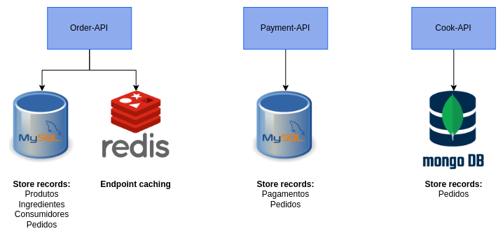
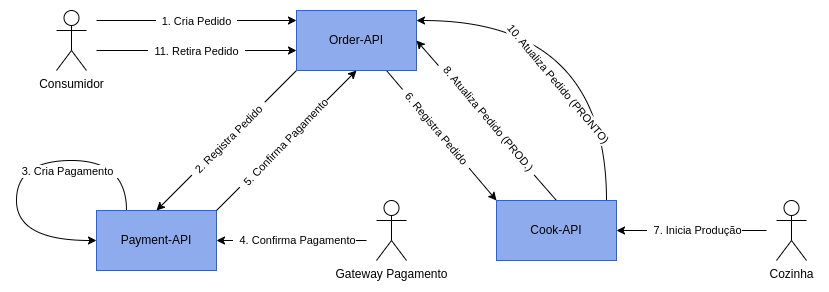

# Architecture Diagrams

## Microservices Architecture

### Services and its Databases

### Services communication (Order Flow)

## Network Infrastructure

## Database Architecture (RDS and Elasticache)

## Kubernetes Cluster (EKS and ECR)

## Auth Service (API Gateway and Amazon Cognito)

## SAGA Pattern (Order Flow)

